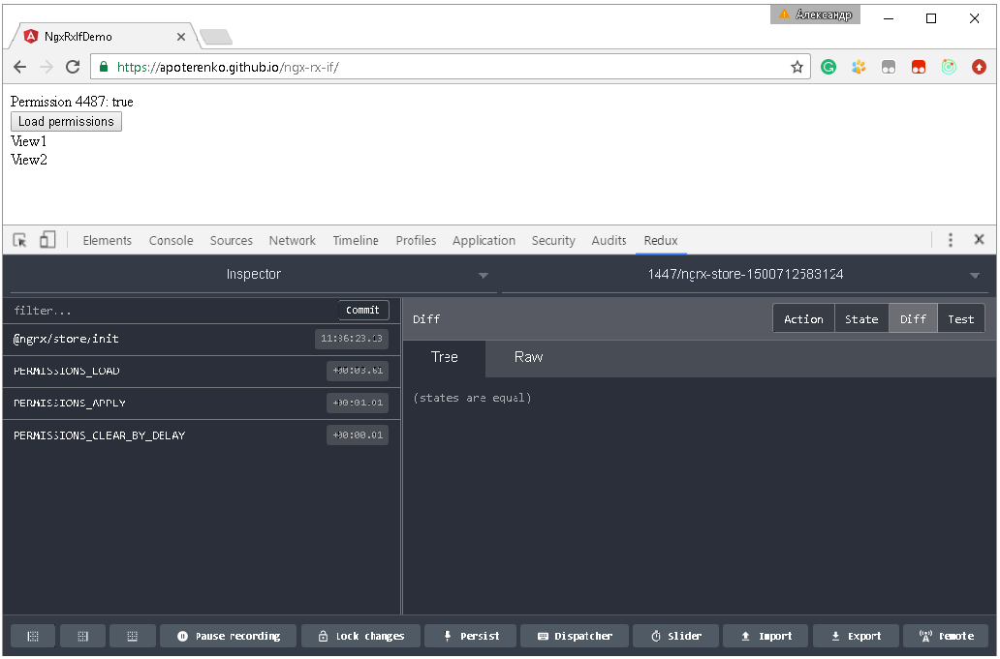
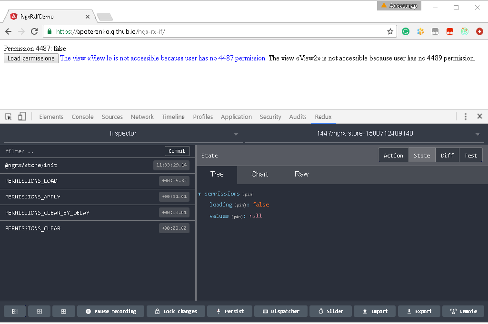

# ngx-rx-if

An implementation of conditional reactive directive based on @ngrx/store (Redux) [Angular 4.3.1 compatible].

## Installation

```sh
npm install ngx-rx-if --save
```

```typescript
import { RxIfModule } from 'ngx-rx-if';

@NgModule({
    imports: [
        ...,
        RxIfModule.forRoot(),
    ]
})
```

## Preview





## License

Licensed under MIT.